#! https://zhuanlan.zhihu.com/p/120360684
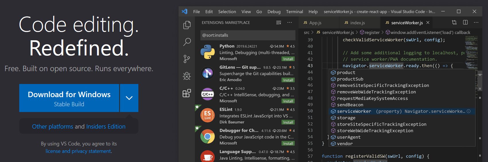
# 使用 VSCode 打造一站式全平台开发体验

# 一、什么是 VSCode

[Visual Studio Code](https://code.visualstudio.com/) 是由微软主导研发的一款[开源代码编辑器](https://github.com/Microsoft/vscode)。

VSCode 与 [Atom](https://atom.io/) 类似，基于 [Electron](https://github.com/electron/electron) 研发，为开发者提供跨平台、插件化、高度可定制的轻量级代码编辑器。

VSCode 提供的主要功能有：

- 基于 [Monaco](https://microsoft.github.io/monaco-editor/) 的代码编辑器，提供全平台开箱即用的高性能代码编辑器；
- 强大的插件体系：
  - 高度可扩展的插件支持，目前各类编辑器/IDE中几乎最强的插件生态；
  - 内置的插件市场、可视化的配置功能，可极其方便地安装扩展；
  - 插件服务器机制，采用进程分离的插件体系，可在使用大量插件进行扩展的同时，保证编辑器前端界面高效流畅；
  - 极度克制的界面扩展，确保插件无法修改软件界面布局与交互方式，确保开发者体验的一致性。
- 基于 [LSP](https://microsoft.github.io/language-server-protocol/) 协议的编程语言插件体系，可通过插件形式支持几乎任何编程语言的语法高亮、重构、静态检查、自动补全、智能提示等功能；
- 基于 [DAP](https://microsoft.github.io/debug-adapter-protocol/) 协议的调试器插件体系，可通过插件形式支持几乎任何编程语言的可视化调试，包括单步运行、变量监测、表达式执行、线程管理、堆栈查询、断点、调试控制台等功能；
- 开箱即用的 [Git 版本管理](https://code.visualstudio.com/docs/editor/versioncontrol)，可通过界面可视化操作轻松进行 commit、branch、checkout、fetch、pull、push、merge、diff、rebase、cherrypick、reset、stash 等各项版本管理操作；
- 通过插件支持基于 [CMake](https://cmake.org) 的项目管理，可直接将`CMakeLists.txt`作为项目文件进行项目管理，与其它插件合作提供代码编辑、版本管理、编译构建、运行调试的一站式开发体验；
- 改变远程开发工作形态的 [VSCode Remote Development](https://code.visualstudio.com/docs/remote/remote-overview)，通过远程开发插件包，无需任何手动部署即可接入任何平台的远程开发机，享受与本地开发几乎一致的使用体验；
- 内置同步功能，可通过微软账号自动同步所有主题、设置、插件等信息。

# 二、安装与使用

## 2.1 下载安装

- Windows：[下载](https://code.visualstudio.com/Download)对应的安装包执行安装即可；
- Linux：[下载](https://code.visualstudio.com/Download) deb/rpm 包，或通过`snap`安装，或通过[添加软件源](https://code.visualstudio.com/docs/setup/linux)方式安装；
- MacOS：[下载](https://code.visualstudio.com/Download)对应的安装包执行安装即可。

推荐下载安装 [VSCode Insiders](https://code.visualstudio.com/insiders/)  预览版，可提前享受新特性，如以前的更新的远程开发，以及本月更新的设置同步。该版本保持每天一次滚动更新。

## 2.2 工具链

- Windows：手动从各类开发工具官网下载安装，或使用[scoop](https://scoop.sh/)管理器提供命令行包管理功能；
- Linux：使用`apt`等包管理命令安装；
- MacOS：使用`homebrew`包管理命令安装；
- [Sarasa Gothic 更纱黑体](https://github.com/be5invis/Sarasa-Gothic)：支持简体中文、繁体中文(香港/台湾双标准)、韩语、日语的编程用等宽字符，基于[思源黑体](https://github.com/adobe-fonts/source-han-sans)的CTK字符和 [Iosevka](https://github.com/be5invis/Iosevka) 的英文字符，提供编辑器、GUI、控制台三套字体族，支持多种字重，支持编程符号连字符（详见 GitHub 页面）；
- [Fira Code 字体](https://github.com/tonsky/FiraCode)：VSCode 官方推荐和演示使用的等宽字体，支持大量编程符号连字符（详见 GitHub 页面）；该字体无中文字符，英文字符宽度较大(0.6)，不如 Iosevka 紧凑，且无法和中文进行等宽混排。

## 2.3 界面说明

### 2.3.1 主界面

VSCode 主界面如图所示，顶部菜单栏与标题栏二合一（Ubuntu 使用系统导航栏菜单）。

主要区域为编辑页面，以及插件页面等，支持标签页和分栏功能；页面右上角提供分栏按钮、扩展菜单，以及其它插件扩展的功能按钮。

界面左侧为导航栏，提供所有代码编辑之外的交互功能，点击可展开/折叠对应的交互页面，插件的复杂界面交互使用导航页面实现。

界面右下方为控制台面板，可提供警告/错误显示、软件/插件输出展示、调试控制台、终端控制台等功能；控制台面板具备自己的工具栏以支持不同类型的面板交互，除面板切换外还支持内部分页、分栏；

左下角为远程开发管理按钮，点击可触发远程开发管理菜单，在已经启动的远程开发会话中还会显示会话名称。

下方为状态栏，用于显示静态检查/编译的错误警告、Git版本等状态提示，也可被插件用于信息推送；信息条目可以被点击交互，触发其它界面功能的联动，如点击错误统计可弹出控制台面板的问题页面。

临时通知会通过右下角浮动消息形式弹出显示和交互。

### 2.3.2 命令面板

VSCode 支持完整的可视化交互操作，并且几乎所有动作（包括插件扩展动作）均可通过快捷键执行，用户也可自行配置修改快捷键，同时提供类似 MacOS Alfred 软件启动器类似的弹出式命令面板，通过`Ctrl + Shift + P`或`F1`打开：

命令面板中可输入中文/英文命令进行各项快捷操作，也可通过键盘、鼠标进行选取。

不同类型的快捷操作通过前缀符号进行区分，上述快捷键打开的面板默认使用`>`命令动作前缀。

所有可用的前缀如下：

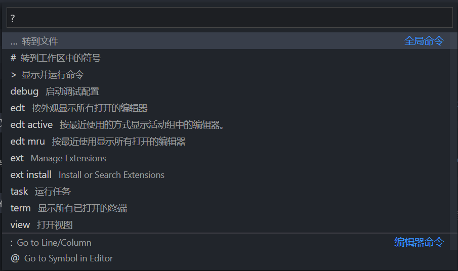

注：转到文件的`...`代指文件名/路径，该模式实际无需前缀。

也可使用`Ctrl + P`快捷键快速打开无前缀的命令面板，用于输入名字跳转文件，或填写其它前缀（如两条编辑器命令）：

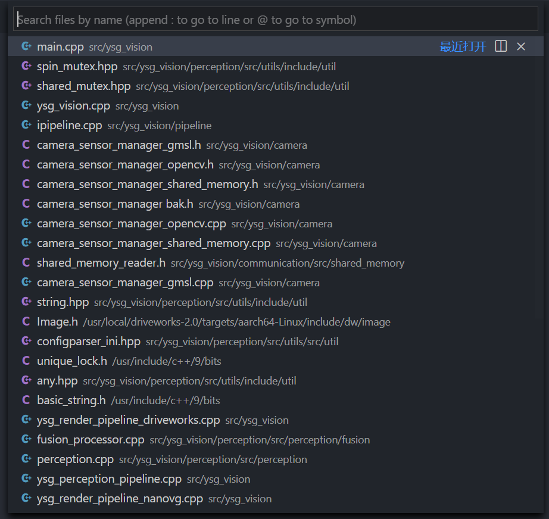

### 2.3.3 控制台面板

点击状态栏的错误列表可打开控制台面板的问题页面，或使用`Ctrl + J`快捷键直接打开到终端页面。

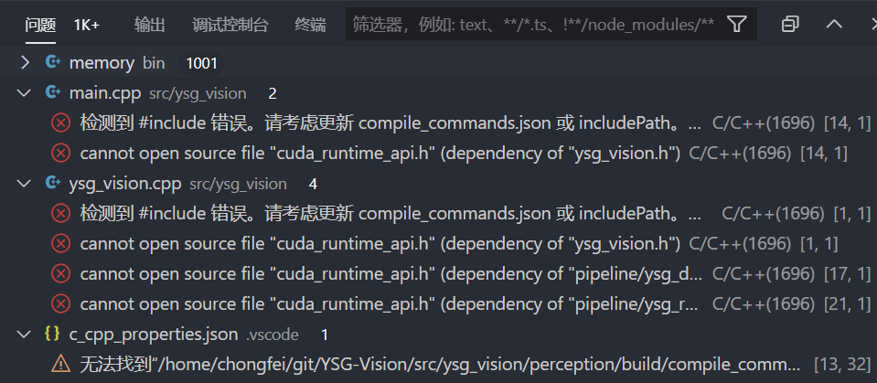

问题页面显示静态校验的各类问题，可点击跳转定位至具体代码。

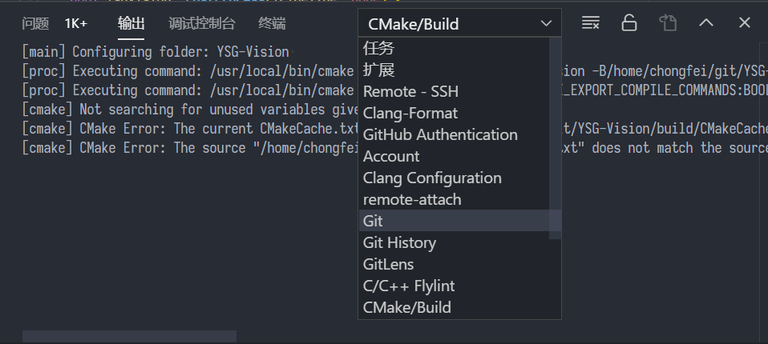

输出页面显示 Git/CMake 输出等各类插件输出信息。

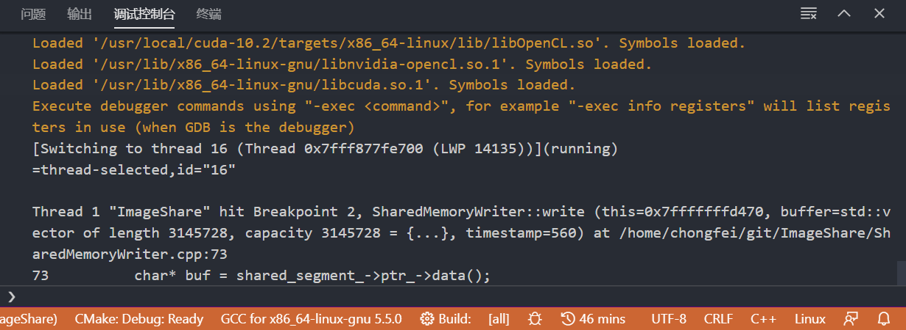

调试页面用于显示[调试控制台](# 2.5 运行/调试界面)，该页面只会显示调试器输出信息，程序数据会显示在`终端`页面，两者不会产生混淆。

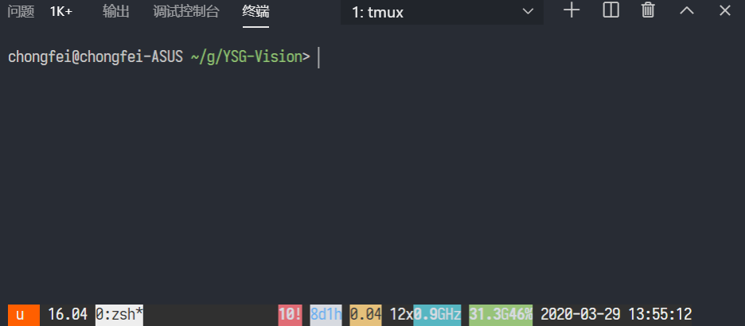

终端页面可通过`Ctrl + J`快捷键直接打开，提供完整功能的终端，在 Linux 上使用`xterm`终端。

终端页面可以点击加号新建页面（通过下拉列表切换），可通过分栏按钮/快捷键分栏，可退出终端或点击关闭按钮关闭当前终端页面。

可在`F1`命令面板中输入`shell`并选取`终端：选择默认 Shell`来设置默认 shell。

## 2.3 编辑器

### 2.3.1 工作区

VSCode 以目录为单位管理项目，在主界面选取并打开目录后，会自动基于该目录建立工作区。

工作区的相关配置会在该目录下的`.vscode`子目录管理，并自动生成各项配置文件，如：

- `settings.json`工作区配置：详见[设置界面](# 2.7 设置界面)；
- `launch.json`启动配置：详见[运行/调试界面](# 2.5 运行/调试界面)；
- `tasks.json`任务配置：可由`F1` - `contigure task`打开设置，一般由`CMake`插件等自动生成，手动自定义配置见[Tasks in Visual Studio Code](https://code.visualstudio.com/Docs/editor/tasks)；
- `c_cpp_properties.json`语言配置：由`C/C +  + `插件自动生成。

已使用过的工作区可在软件欢迎界面点击打开，或通过菜单栏选取打开，或直接打开工作区目录。

工作区启动后会恢复上次退出前的编辑状态，包括打开文件、界面分栏、光标位置等。

VSCode首个窗口启动时会自动打开最后一次关闭的工作区。

### 2.3.2 编辑界面

编辑界面布局如图所示：

编辑区可通过按钮/快捷键进行上下左右分区，同时大多数轻量级插件交互会集成在右上角的工具栏按钮。

编辑区顶部的文件路径，每一级均可点击切换该级内容，最后一级为当前文件的大纲列表。

编辑区右侧滚动条旁会显示文件内容缩略图：

- 点击拖动缩略图可进行滚动操作；
- 鼠标移动至缩略图区域后自动显示滚动条，移开自动隐藏；
- 右侧滚动条栏通过颜色标记表示当前文件提示，如静态校验错误位置（深红色标记）、代码变更版本提示（浅红色删除标记）

左侧若选择`资源管理器`页面，则可查看打开文件列表、目录树、当前文件大纲视图等（TODOS列表为TO-DO插件扩展）。

### 2.3.3 搜索/替换

通过`Ctrl + F`/`Ctrl + H`展开搜索/替换浮动工具；若在左侧选择`搜索/替换`页面，则可进行全局搜索/替换操作：

如图，点击搜索栏左侧向下箭头可展开替换栏，点击右侧`...`按钮可展开文件包含/替换设置。

搜索栏按钮可进一步设置大小写敏感、全字匹配、[正则表达式](https://regexr.com/)等进阶控制。

点击替换栏最右侧按钮可进行全部替换。

搜索结果列表中，点击文件右侧`×`关闭，则可不参与替换。

点击结果文件，可打开文件编辑页面；若为替换模式，则打开 diff 页面。

搜索/替换浮动工具的功能和界面交互与全局搜索/替换工具栏交互方式相同，用于单文件内部搜索/替换。

### 2.3.4 快捷键

- 常规编辑：键盘/鼠标操作普通文本编辑器相同，如复制粘贴、`Shift`选取、剪切/复制/粘贴等；
- 列选取：按下`Shift + Alt`的同时使用鼠标拖动进行列选取，后续键盘操作为列编辑；
- 列编辑：`Ctrl + Alt + ↑`和`Ctrl + Alt + ↓`移动光标进行列编辑；
- 行移动：按`Alt + ↑`和`Alt + ↓`向上/下移动当前行，不支持多行操作；
- 行复制：`Shift + Alt + ↑`和`Shift + Alt + ↓`可对当前行/列编辑光标所在行列表、或选中行列表，执行向上/向下的复制操作；
- 剪切：无选择时，`Alt + X`自动剪切光标所在行，若为列编辑则同时剪切多行；
- 单词跳转：`Ctrl + ←`和`Ctrl + →`进行单词跳转；
- 撤销/重做：`Ctrl + Z`撤销，`Ctrl + Shift + Z`或`Ctrl + Y`重做；
- 前后跳转：当使用鼠标点击、定义跳转等方式移动过光标时，可使用`Alt + ←`和`Alt + →`在跳转记录间后退/前进；
- 重命名：通过`F2`或右键选项，输入新名称，可通过搜索替换功能，在基于语义分析的基础上对当前标识符进行重命名；具备复杂引用的标识符，会展开`引用`侧面栏进行重命名替换管理；
- 显示定义：按`F12`或通过右键选项，可跳转至新页面显示标识符定义；
- 查找引用：按`Shift + F12`或右键选项，可在叠加弹窗中显示当前标识符的引用列表，双击叠加弹窗内容会打开页面进行编辑；
- 所有引用：按`Shift + Alt + F12`或右键选项，可在`引用`侧面栏中搜索显示全局引用；
- 智能提示/自动补全：输入过程中，相关语言插件会根据需求弹出智能提示，使用`↑`/`↓`进行切换，使用`Enter`/`Tab`选取当前补全项，使用`Esc`关闭当前补全；
- Zen Mode：`Ctrl + K Z`或通过`查看 - 外观 - 禅模式`或通过命令面板 `zen` 启动禅模式，会关闭所有导航栏、工具栏、标题栏、菜单栏等外部组件，将当前文件编译区域全屏，进行沉浸式编辑；禅模式中可以使用 `Alt` 弹出菜单栏，使用快捷键弹出命令面板；再次使用组合键或命令面板退出禅模式。

### 2.3.5 代码片段

此项为高级技巧，不作详细说明，详见 [Snippets in Visual Studio Code](https://code.visualstudio.com/docs/editor/userdefinedsnippets) 和 [Emmet in Visual Studio Code](https://code.visualstudio.com/docs/editor/emmet)。

## 2.4 Git 页面

点击导航栏的 Git 分支图标可打开 Git 版本管理页面，如下图所示：

VSCode侧面面板通过多个树形控件，结合按钮、编辑框、菜单进行交互，所有侧面面板插件均使用相同的交互方式。

Git面板中第一栏显示当前工程的所有 GIt 项目及子项目。使用数字标签显示修改数量；后续显示当前分支/版本，可点击进行分支操作；右侧提供同步按钮，点击后可自动执行`pull & push`操作同步一站式本地与远端版本（若存在无法自动修复的冲突则需要编辑修复提交合并）。

每个子项目使用独立的树形控件交互，默认显示主项目，可在控件标题栏右键菜单展开其它项目的控件，或直接在项目列表点选子项目切换项目控件内容。

项目控件标题栏按钮：

- 文件树切换：切换文件展示模式为列表模式或目录树模式；
- 刷新：执行`git status`等指令刷新列表状态，默认会在后台自动刷新；
- 提交：使用当前填写的提交日志和暂存列表进行提交；
- 历史：Git History 插件拓展按钮，打开可视化的 Git 版本树界面；
- 菜单：更多功能菜单。

项目控件中列举了当前更改/暂存的文件列表，可通过右键展开详细交互菜单，也可点击界面按钮执行交互：

- 更改栏按钮：全部 stash、全部回滚、全部暂存；
- 更改文件按钮：文件编辑、文件版本历史查看、暂存、stash、回滚等；
- 暂存栏按钮：全部stash、全部回归；
- 暂存文件按钮：打开文件、取消暂存。

此处`暂存`指`git add`到 stage，并非`git stash`。

点击更改/暂存的文件，可在编辑器区域打开 diff editor，左侧为更改/暂存前内容，右侧为更改/暂存后内容，其中更改文件的右侧区域可直接编辑。

在 diff editor 中的高亮的更改代码，可选中后右键暂存/取消暂存/回归，以实现精确到行的控制。

## 2.5 运行/调试界面

点击左侧导航栏的`三角&bug`按钮可切换至运行/调试界面：

侧面控制栏顶部为运行/调试控制，以列表形式选择当前可用的启动项列表，可点击绿色三角启动，点击齿轮打开`launch.json`进行[自定义配置](https://code.visualstudio.com/docs/cpp/launch-json-reference)，点击控制台按钮切换至调试控制台。

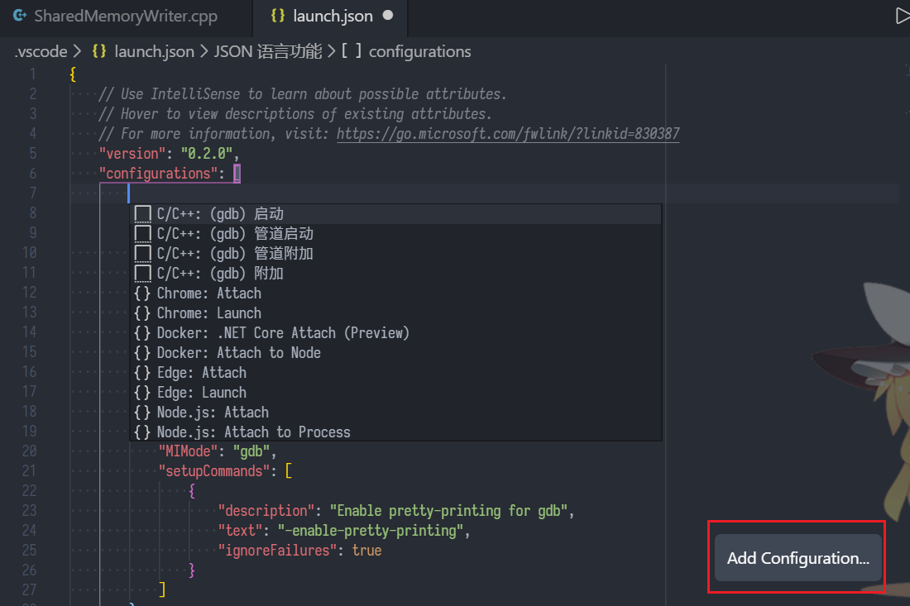

修改启动配置时，除智能提示外，可点击右下角的 `Add Configuration...` 按钮添加对应模板。

若使用`CMake`插件对工程完成配置，则可自动生成启动项，点击启动调试或按`F5`进行调试。

调试界面说明：

- 调试控制栏：窗口顶部显示浮动的调试控制工具栏，也可通过`F5运行`、`F10单步跳过`、`F11单步进入`、`Shift + F11单步跳出`等快捷键进行控制；
- 变量栏：在暂停时，变量栏展示当前函数栈的栈变量列表和可能存在的全局变量列表，通过右键菜单进行进一步操作；
- 监视栏：监视栏可从变量栏 右键添加变量到监视列表，或者手动输入表达式以显示表达式执行结果；
- 调用堆栈栏：显示当前所有线程列表和每个线程的调用栈，单击切换调用栈，同时联动切换变量栏、监视栏和编辑区域；
- 断点栏：显示当前设置的所有断点，可右键编辑条件断点、命中次数等高级功能，在编辑区域点击行号前方可添加/删除断点。
- 编辑区域：高亮显示当前执行点，鼠标指向变量可显示变量内容，复杂变量可在显示游标中点击进行层级展开；
- 状态栏：显示当前的各项构建、调试状态，并可点击交互；
- 终端：运行/调试会自动启动一个新的终端页面进行执行，所有程序输出会在该终端页面显示；
- 调试控制台：调试控制台中可与调试器进行控制台交互。该面板只显示调试器输出，不会与目标程序输出混淆。通过界面操作获取的调试信息不会在调试控制台显示输出。gdb 下，调试控制台为 print 模式，可直接输入变量/表达式获取输出数据。

## 2.6 同步

VSCode 自  March 2020 (version 1.44) 版提供了官方的同步功能，无需使用传统的 Setting Sync 插件（该插件还需翻墙依赖 gist）。

该版本目前为 [VSCode Insider](https://code.visualstudio.com/insiders/) 预览版，软件内有更新说明，软件外可查看 [March iteration plan](https://github.com/microsoft/vscode/issues/92242) 浏览详细内容。

点击左下角 `管理按钮` - `同步` 打开同步配置命令面板：

开启同步，会跳转打开 `Microsoft账号` 浏览器页面，在其中登录账号并关联授权后，自动启动同步功能。

同步功能会自动同步如下内容：

- 插件列表
- 配置列表
- 按键绑定

各项同步内容，可在对应项的配置位置（插件管理、设置管理）中关闭该项同步，也可在设置管理的同步设置中手动填写忽略同步的内容。

## 2.7 设置界面

通过侧面导航栏底部 管理按钮 - 设置，或`Ctrl + ,`快捷键，或在命令面板选择`settings` - `首选项：打开设置(ui)`打开可视化设置界面：

设置页面包含三个分页：

- 用户设置：当前系统用户的全局设置；
- 远程：在连接了远程开发时，用于单独配置远程目标机的设置，该设置默认继承用户设置；
- 工作区：当前工作区`.vscode/settings.json`中的设置，默认继承用户设置。

所有软件设置和插件设置均在此页面进行配置，已修改的设置会有蓝色线条标记。

可点击设置项前方的工具按钮进行进一步调整，如是否使用[同步功能](# 2.6 同步)同步此设置。

可点击右上角的切换按钮，或在命令面板选取`settings` - `首选项：打开设置(json)`打开配置文件，在其中进行复杂内容编辑（多用于插件中的自定义扩展设置）。

json 编辑模式中包含代码提示/自动补全，帮助用户填充条目名称。条目内容包含类型和数值校验，在输入不合法时会显示提示信息。

常用设置：

- `[语言名称]`：json object，可在其中单独配置目标语言的设置内容；
- `editor.fontLigatures`：启动字体连字符，如 [FiraCode](https://github.com/tonsky/FiraCode) / [SarasaGothic](https://github.com/be5invis/Sarasa-Gothic) 字体；
- `editor.fontFamily`：字体列表，填写 json 字符串，多个字体使用单引号包括并使用英文逗号分隔，按先后顺序依次匹配使用；
- `editor.fontSize`：编辑器默认字体大小
- `editor.renderWhitespace`：编辑器显示空格的形式，推荐`boundary`；`
- `editor.rulers`：在指定行宽位置显示垂直标尺，使用数组模式，可配置多个标尺；
- `editor.formatOnSave`：是否在保存文件时自动格式化，推荐开启；
- `editor.formatOnType`：是否在完成行编辑(`C++`中为输入`;`后)后自动格式化；
- `diffEditor.ignoreTrimWhitespace`：diff editor 是否自动忽略不显示行首或行尾空格变更，推荐开启（可在 diff editor 右上角工具按钮中切换显示模式）；
- `git.autofetch`：是否在后台自动执行`git fetch`操作更新存储库；
-
- `files.autoGuessEncoding`：根据文件内容自动识别编码；
- `files.defaultLanguage`：新建文件，未保存选择文件名时，默认使用的编程员；
- `files.trimTrailingWhitespace`：保存文件时是否自动删除所有行尾空格，推荐打开；
- `files.exclude` / `file.watcherExclude` / `search.search`：文件忽略列表，适用于`bin`/`config`/`node_modules`等各类语言、编辑器、语言服务器的文件目录，在语法解析、搜索等操作中自动忽略；
- `search.useGlobalIgnoreFiles`：是否使用全局`.gitignore`和`.ignore`文件过滤，此项默认关闭，推荐打开（本工程文件过滤默认打开）
- `files.insertFinalNewline`：保存文件时是否确保文件末尾存在空行，推荐开启，因为在许多 Linux 编辑器中，以`\n`结尾的文本才被认为为一个完整的文本行；
- `workbench.colorTheme`：主题选择，也可通过命令面板切换，或通过`Ctrl + K`接`Ctrl + T`组合快捷键选择；

# 三、推荐插件

所有插件都提供了基础的开箱即用，但强烈建议在[设置界面](# 2.7 设置界面)中进行进一步设置。

## 3.1 [Remote Development](https://marketplace.visualstudio.com/items?itemName=ms-vscode-remote.vscode-remote-extensionpack)

VSCode 远程开发扩展包，彻底改变远程开发的工作模式，包含如下插件：

- [Remote - SSH](https://marketplace.visualstudio.com/items?itemName=ms-vscode-remote.remote-ssh)：基于 SSH 的远程开发；
- [Remote - Containers](https://marketplace.visualstudio.com/items?itemName=ms-vscode-remote.remote-containers)：基于 Docker 容器的远程开发；
- [Remote - WSL](https://marketplace.visualstudio.com/items?itemName=ms-vscode-remote.remote-wsl)：基于 [Windows Subsystem for Linux(wsl)](https://docs.microsoft.com/en-us/windows/wsl) 的远程开发。

此处重点讲解 Remote SSH 远程开发，其它两类使用相同机制和开发模式，完整的远程开发用户手册详见 [VS Code Remote Development](https://code.visualstudio.com/docs/remote/remote-overview)。

与传统的 SSH 挂载到目标机器，在其中使用 `vim` 等控制台编辑器或通过 `X forward` 的远程界面不同的区别在于：

- VSCode 连接目标机后，会在目标机自动部署 Remote Server，部署路径为 `~/.vscode-server/` 或 `~/.vscode-server-insiders/`，无需手动进行部署；
- 远程开发时，用户交互界面依旧在本地机器中进行本地运行，不会受远程连接网络延时造成的界面卡顿，无需使用 `X forward`并付出大量带宽开销，可以享受与本地开发几乎相同的体验；
- 语言服务器(LSP)、调试服务器(DAP)等与构建、运行环节相关的内容和相关插件(workspace类型)，由远程机的 Remote Server 运行；VSCode 前端界面(以及ui类型插件)在本机运行。通过远程连接作为客户端与远程机连接；
- 终端面板中的 shell 由远端服务器启动，等价于远端机上的原生终端，而非通过本机 SSH 启动，SSH 连接因为网络等因素意外中断后，远程终端和其中的任务不会停止，重连后可继续控制；
- 可配置为自动安装插件至远端，也可手动在插件列表中安装至远端。远端插件安装通过远程连接从本机传输，因此远端机无需接通互联网；
- VSCode 工作区记录中也会记录远端工作区，可在欢迎界面（或开始菜单软件图标右键选项）直接开启，连接并恢复远端工作区。

点击界面左下角蓝色图表，可弹出远程开发命令面板：

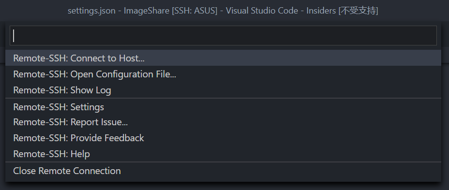

- Connect to Host：选择并连接 SSH 配置中的主机列表；也可输入直接输入主机地址进行连接(`name@address`)；还可以选择 `Add New SSH Host...`，然后输入完整的`ssh`指令，将该主机添加至 SSH 配置文件并连接——此方式支持附加额外的 SSH 参数，如 SSH 跳板、端口指定等，这些参数会被自动添加到 SSH 配置文件中。
- Open Configuration File...：列表选取 SSH 配置文件并打开，也可选择跳转到设置界面，配置自定义 SSH 配置文件。

连接到主机后，界面顶端会弹出密码输入栏用于登录：

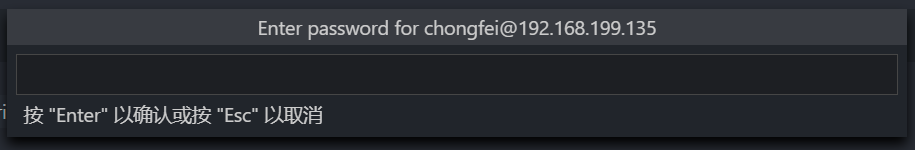

若主机设置中存在 SSH 跳板，则需依次输入每级跳板的密码（若未使用密钥登录）。

在界面左侧导航栏中选择`远程资源管理器`可打开管理面板：

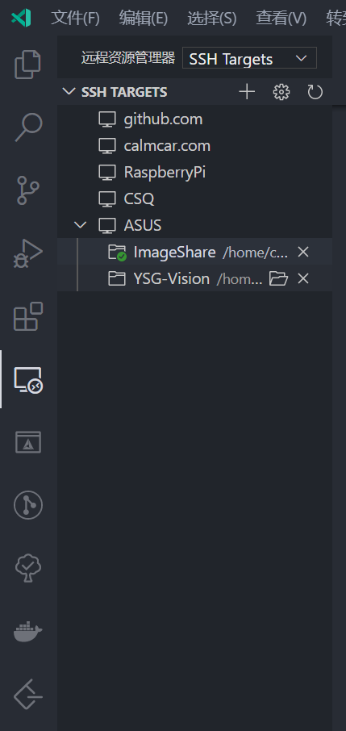

右上角下拉菜单可选取切换远程连接模式。

面板列表中以树状列表显示 SSH 配置文件中的所有主机列表，和该主机下打开过的工作区，可选取并连接打开对应的工作区。

远程开发模式下，构建、调试、控制台通过 Remote Server 在目标机本地执行；打开文件/文件夹时，不再会弹出文件对话框，而是通过命令面板的形式进行交互。

使用 SSH 跳板进行多级跳转时，若在 Windows 上连接 Linux 工作机，则会因为反斜杠格式的 SSH 配置文件路径无法解析，导致跳板机下一级连接失败。需要在设置界面的`remote.SSH.configFile`中用正斜杠语法显示注明 SSH 配置文件路径。此项配置为 Windows 平台特有，故建议在配置项左侧设置按钮中，勾选取消`同步此设置`。

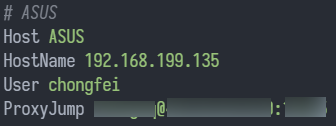

上图为通过公网跳板机跳转至内网开发机的配置范例。

## 3.2 [Chinese (Simplified) Language Pack](https://marketplace.visualstudio.com/items?itemName=MS-CEINTL.vscode-language-pack-zh-hans)

中文语言包，安装后在命令面板输入 `language`，选择 `Configure display language` 切换界面语言。

## 3.3 编程语言

当 VSCode 打开未支持的语言的代码文件时，编辑器会自动识别语言，并提示是否安装对应的语言插件，点击后即可跳转到插件列表搜索对应语言插件。

- [C/C++](https://marketplace.visualstudio.com/items?itemName=ms-vscode.cpptools)：官方提供的 `C/C++` 语言插件，提供智能补全、代码高亮、调试支持、代码重构、代码格式化、代码片段、单元测试等功能，支持 `MSVC` / `gcc` / `clang`编译器，建议对语言标准、格式化标准等细节进行配置。头文件排序建议选`false`（因为有的库文件包含顺序存在前后依赖，比如`windows.h`和`winsock.h`，比如`gl.h`和`SDL.h`）。
- [C/C++ Advanced Lint](https://marketplace.visualstudio.com/items?itemName=jbenden.c-cpp-flylint)：`C/C++` 静态校验支持，提供 `clang`/ `cppcheck` / `Flexelint 或 PC-lint` 的接入，可在代码编辑的同时对代码进行静态检查，并通过下划线警告、状态栏警告、问题控制台等方式进行提示；需要安装对应的静态检查工具，并在插件配置中设置参数，Windows 上推荐用 `scoop` 安装。
- [CMake](https://marketplace.visualstudio.com/items?itemName=twxs.cmake)：`CMake` 语言编辑支持。
- [Python](https://marketplace.visualstudio.com/items?itemName=ms-python.python)：官方提供的 `Python` 语言插件，提供语言插件各项功能；并支持 [Jupyter Notebooks 接入](https://code.visualstudio.com/docs/python/jupyter-support)，可直接编辑、浏览 `Jupyter` 文档，并单独执行其中的代码单元。
- [autoconf](https://marketplace.visualstudio.com/items?itemName=maelvalais.autoconf)：Autotools 代码高亮编辑支持。
- [vscode-cudacpp](https://marketplace.visualstudio.com/items?itemName=kriegalex.vscode-cudacpp)：`CUDA` 语言高亮、自动补全、代码片段等支持。
- [vscode-proto3](https://marketplace.visualstudio.com/items?itemName=zxh404.vscode-proto3)：`Protobuf 3` 语言支持。
- [Cloudfoundry Manifest YML Support](https://marketplace.visualstudio.com/items?itemName=Pivotal.vscode-manifest-yaml)：YML 配置脚本语言支持。
- [XML](https://marketplace.visualstudio.com/items?itemName=redhat.vscode-xml)：由 Red Hat 维护的 XML 语言支持插件，支持包括 `XML` / `DTD` / `XSD` / `XSL` 等的 XML 语言体系，需要 `jvm` 提供 LSP 支持。

## 3.4 构建工具

- [CMake Tools](https://marketplace.visualstudio.com/items?itemName=ms-vscode.cmake-tools)：`CMake` 构建工具支持，通过命令面板进行交互，也可在状态栏点击交互，如切换构建模式(debug/release)、切换构建套件(编译器)等；可通过命令面板选项打开 `CMakeCache.txt` 修改变量；可自动完成 `launch.json` 配置，自动接入编译器/调试器，打造类似 IDE 的一站式开发体验。
- [Qt tools](https://marketplace.visualstudio.com/items?itemName=tonka3000.qtvsctools)：**非Qt官方**的 Qt 插件，功能比较简单，提供启动外部 Qt 工具链程序、调试器接入 Qt 库源码，需要从 CMake 缓存中解析 Qt 路径。

## 3.5 Git 增强

### 3.5.1 [Git History](https://marketplace.visualstudio.com/items?itemName=donjayamanne.githistory)

提供可视化的 Git 版本树管理，可通过命令面板或界面按钮激活。

文件历史管理，也可通过文件编辑器右上角按钮打开。

项目历史管理，能够可视化查看并管理版本树。

### 3.5.2 [GitLens —  Git supercharged](https://marketplace.visualstudio.com/items?itemName=eamodio.gitlens)

将 `git blame` 无缝整合到编辑器中的可视化工具。

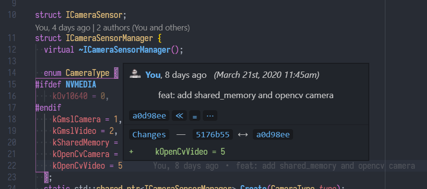

当前行末尾会显示改行最近一次修改记录，鼠标悬停后显示修改记录，并可点击进入相关界面。

代码块开头会显示该代码块最近一次编辑记录和作者信息，点击可打开版本注解界面。

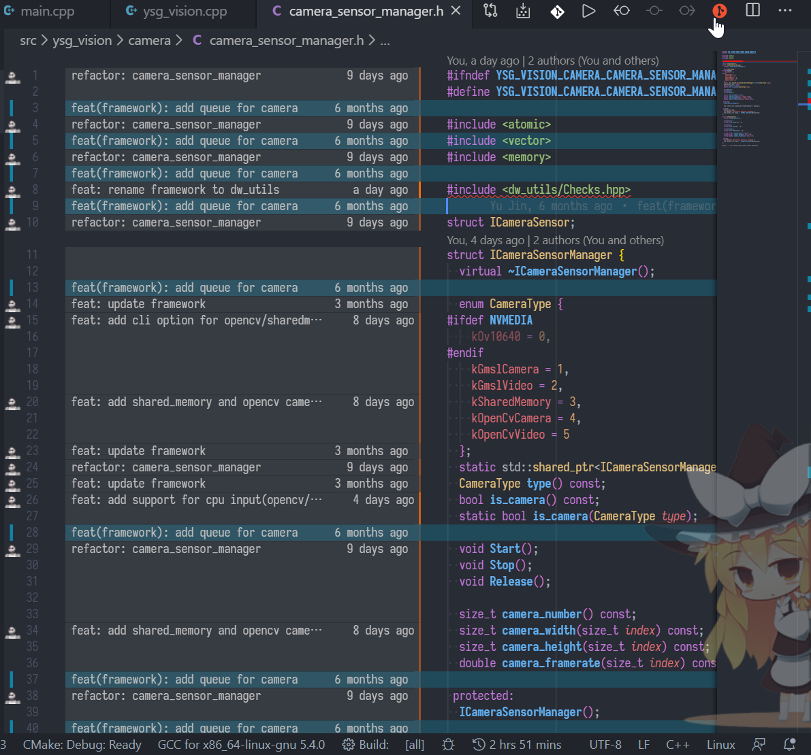

点击代码块开头的作者信息，或右上角的 `File Annotations` 按钮，可查看该文件每一行的版本注解，并自动高亮当前光标修改版本的所有对应行。

当前代码行的版本标注同时也会在状态栏显示。

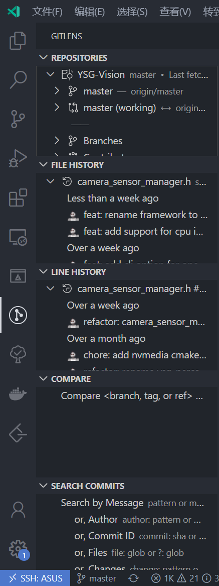

通过导航栏按钮可可以打开 Git Lens 的控制面板，在其中可详细查看所有子项目、所有分支/tag的所有版本记录，并对任意版本进行对应的查看/拉取/合并等操作。

## 3.6 AI 补全

### 3.6.1 [Visual Studio IntelliCode](https://marketplace.visualstudio.com/items?itemName=VisualStudioExptTeam.vscodeintellicode)

微软官方提供的基于 AI 辅助的自动补全功能，支持 `Python`、`TypeScript`/`JavaScript`和`Java`语言。

在 Visual Studio 中，还支持 `C#`、`C++`、`XAML`语言。

### 3.6.1 [TabNine](https://marketplace.visualstudio.com/items?itemName=TabNine.tabnine-vscode)

极度强大的 AI 辅助智能补全，支持几乎所有编程语言。

详见[官方网站](https://tabnine.com/)。

<video autoplay="" muted="" loop=""><source src="https://update.tabnine.com/v/cpp_demo_1.mp4" type="video/mp4"></video>

[官方演示：C++ 智能补全](https://update.tabnine.com/v/cpp_demo_1.mp4)

<video autoplay="" muted="" loop=""><source src="https://update.tabnine.com/v/python_demo_1.mp4" type="video/mp4"></video>

[官方演示：Python 智能补全](https://update.tabnine.com/v/python_demo_1.mp4)

**技术原理**

TabNine 使用基于自然语言识别的深度学习工具，使用 `GitHub` 上各种语言的超过2百万个源码文件进行训练，绕过了语义分析的步骤，直接基于纯文本分析整理并预测用户的代码编辑，提供传统的语义分析模式的智能补全所无法支持的功能。

**特点**

- 基于文本分析而非语义分析，支持几乎所有编程语言；
- 可通过配置，使用当前项目进行学习，从而优化智能提示；
- 支持通过 LSP 协议接入语言服务器，从而提供语义分析辅助；
- 通过付费订阅专业版，可使用云端服务器进行模型学习和运行，避免本机性能不足影响体验；
- 支持多种主流代码编辑器： VSCode、IntelliJ Platforms、Sublime Text、Vim、Emacs、Atom、Jupyter Notebook。

**安装设置**

基于预训练模型的版本开箱即用，初次使用需下载约 700MB 的模型文件。

远端开发时，需要安装部署在远程机，远程机下载模型依然使用互联网，可手动拷贝部署模型文件。

TabNine 不使用 VSCode 的配置界面，具备自己的配置方式，在编辑区输入 `TabNine::config`，可自动跳转浏览器打开配置界面，常用设置项有：

- 专业版激活：可使用 GPU 运行模型，并且自动学习不限制当前代码工程大小；早期可使用使用邮箱申请注册，且并无试用期限制，现在只可试用14天；
- `Enable TabNine Local`：在本机启用模型运行，使用 CPU 运行；
- `Update TabNine automatically`：自动联网更新模型文件。

**语义分析**

基于语义分析的模式，可以借助 LSP 协议接入语言服务器，提升智能补全准确度。

编辑界面输入 `TabNine::sem` 开启语义分析，补全栏出现错误提示时使用 `TabNine::restart` 重启语言服务器。

若有其它问题，可手动配置语言服务器，配置方式详见 [Semantic Completion](https://tabnine.com/semantic)。

- C/C++：默认使用 [clangd](https://clangd.llvm.org/installation.html) 语言服务器；
- Python：使用 `pip install python-language-server pyls` 安装语言服务器。

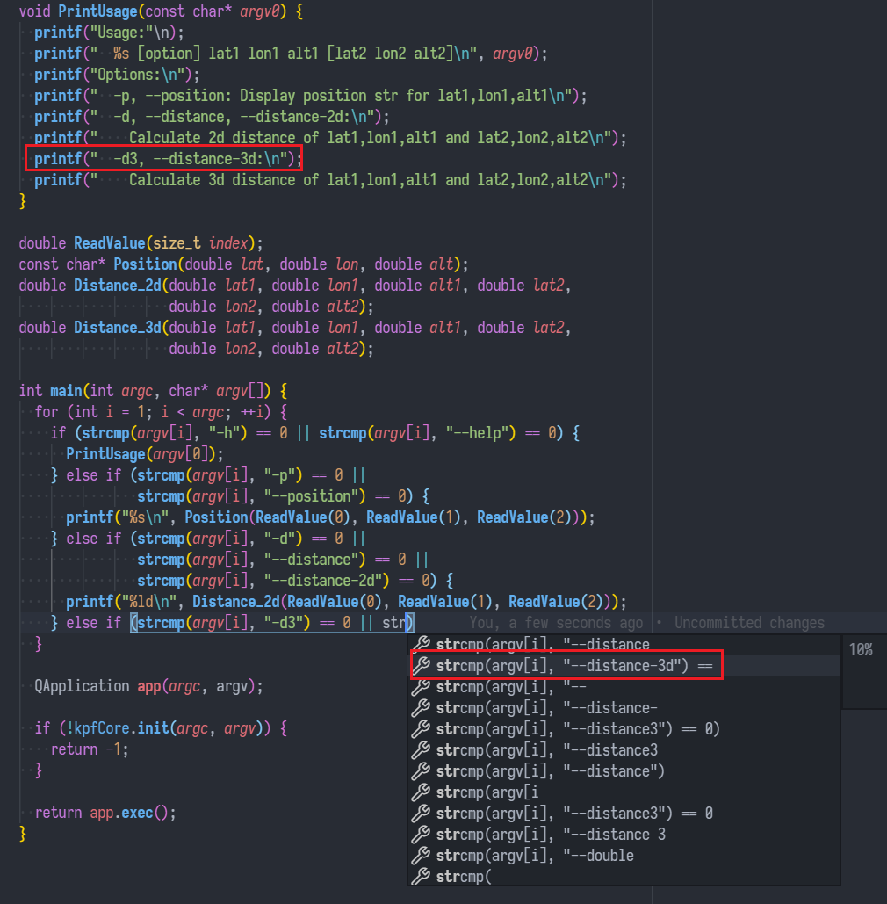

启用语言分析后的智能提示。

## 3.7 [Vim](https://marketplace.visualstudio.com/items?itemName=vscodevim.vim)

Vim 模拟器接入，支持绝大部分 Vim 特性，可将编辑页面模拟为 Vim 应用。

详细用法见插件说明，及[各类 Vim 教程](https://www.zhihu.com/topic/19673543/top-answers)。

## 3.8 [Docker](https://marketplace.visualstudio.com/items?itemName=ms-azuretools.vscode-docker)

`Docker File` 语言支持和 docker 容器管理。

## 3.9 附加工具

- [Doxygen](https://marketplace.visualstudio.com/items?itemName=bbenoist.Doxygen)：Doxygen 文档工具支持，`doxyfile` 编辑支持；
- [Code Runner](https://marketplace.visualstudio.com/items?itemName=formulahendry.code-runner)：支持数十种语言的代码片段执行，包括 C/C++/Python/CUDA等，可通过快捷键/右上角按钮直接编译并执行选中代码片段或当前代码文件，对于 C/C++ 等编译型语言需要对插件进行设置；
- [Wakatime](https://marketplace.visualstudio.com/items?itemName=WakaTime.vscode-wakatime)：[Wakatime](https://wakatime.com)  的 VSCode 接入，可自动记录编辑器活动记录，包括时间、语言、工程，每周生成统计报告并推送至邮箱。
- [RegExp Preview and Editor](https://marketplace.visualstudio.com/items?itemName=Lulus.vscode-regexp-preivew)：通过命令面板启动，在分栏页面中编辑正则表达式，并以数据流图可视化显示正则语法结构；
- [Todo Tree](https://marketplace.visualstudio.com/items?itemName=Gruntfuggly.todo-tree)：识别并高亮代码中的 `TODO` / `FIXME` 等注释，并在导航栏提供侧方面板用于列表查看，可自定义高亮的关键字列表和样式；
- [Color Picker](https://marketplace.visualstudio.com/items?itemName=anseki.vscode-color)：通过命令面板启动，弹出颜色选取对话框进行去色，并以颜色代码形式输出到代码中；

## 3.10 美化

- [One Dark Pro](https://marketplace.visualstudio.com/items?itemName=zhuangtongfa.Material-theme)：自 Atom 移植的主题，是目前使用数量最高的黑色主题，可在设置界面中配置是否开启粗体、斜体、vivid 风格，修改设置后会重新生成主题，需要重新选取主题；
- [Color Highlight](https://marketplace.visualstudio.com/items?itemName=naumovs.color-highlight)：将代码中的颜色代码以对应颜色高亮显示；
- [background](https://marketplace.visualstudio.com/items?itemName=shalldie.background) & [Fix VSCode Checksums](https://marketplace.visualstudio.com/items?itemName=lehni.vscode-fix-checksums)：为编辑器添加背景图片；Windows 中需要管理员权限激活，Ubuntu 中需要设置文件所有权，详见 background 插件说明；修改后启动时会报校验错误警告，需要通过 Fix VSCode Checksums 插件修复。
